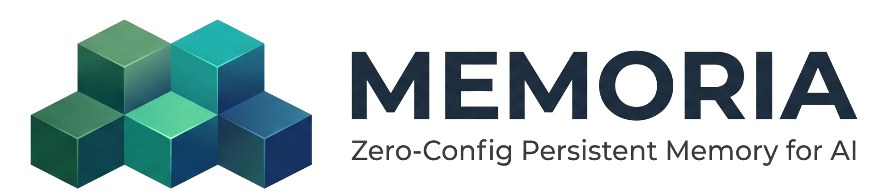
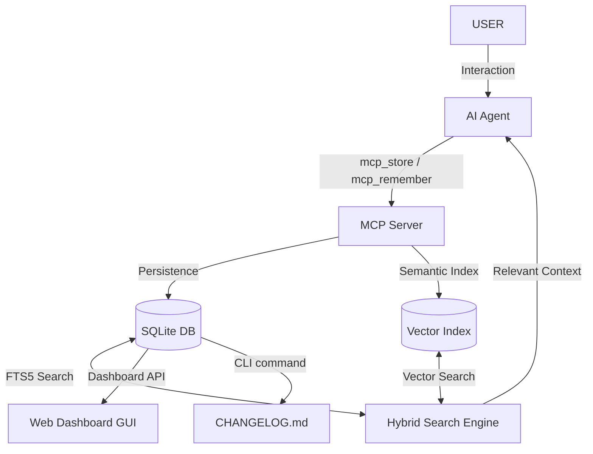

<p align="center">
  
</p>

# Memoria

**Memoria** is a Zero-Config, TypeScript-native persistent memory system for AI agents. It integrates seamlessly with the Model Context Protocol (MCP) to provide agents with a long-term memory that is both efficient and relevant.

---

## 🏗️ Architecture



---

## 🚀 Quick Start

### 1. Installation & Setup
Initialize the Memoria environment on your machine:
```bash
npx @henrycamposeco/memoria setup
```
This creates the necessary database and vector storage in a local `.memoria` directory within your project root.

### 2. Connect Your Agent (MCP)
Add Memoria to your MCP client (e.g., Cursor, Claude Desktop). 

**Config JSON (Development):**
To use your local development version with project-local storage:
```json
{
  "mcpServers": {
    "memoria": {
      "command": "node",
      "args": ["D:/Antigravity/Memoria/dist/mcp/server.js"],
      "env": {}
    }
  }
}
```
> [!IMPORTANT]
> Ensure you have run `npm run build` before connecting. Using the local path ensures Memoria uses the project-local `.memoria` directory.

### 3. Synchronize Your Changelog (New!)
Automatically generate a technical changelog from your agent's memories:
```bash
npm run save-changelog
```
This uses **Semantic Changelog** tags (Added, Changed, Fixed) and filters out duplicate entries using memory IDs.

---

## CLI Command Reference

| Command | Description |
| :--- | :--- |
| `npm run setup` | Initial environment configuration. |
| `npm run dashboard` | Launch the Web GUI at `http://localhost:3000`. |
| `npm run save-changelog` | Generate/Update `CHANGELOG.md` from memories. |
| `npm run cli store -- [options]` | Manually inject a memory into the system. |
| `npm run cli persona [project] [type]` | Set branding style (architect, slang, grumpy). |

**Manual Store Example:**
```bash
npm run cli store -- -t "change title" -c "change content..." --type bug
```

---

## The Agent's Toolset (MCP)

> [!NOTE]
> These tools are meant for the **AI Agent** to call automatically.

- `mem_store`: Save a new observation.
- `mem_remember`: Search for relevant memories.
- `mem_context`: Get a snapshot of recent project context.
- `mem_set_persona`: Sets a project-wide branding style.
- `mem_distill`: Summarizes old memories to save space.
- `mem_edit`: Update an existing memory by ID.
- `mem_delete`: Remove a specific memory by ID.

## Features

- **Zero-Config**: Works out-of-the-box with local SQLite and ONNX embeddings. 
- **Hybrid Search**: Combines SQLite FTS5 with Vector semantic understanding.
- **Token-Efficient**: Automatically manages context window budgets.
- **Semantic Changelog**: Bridges the gap between agent memories and project documentation.

## License

Apache-2.0